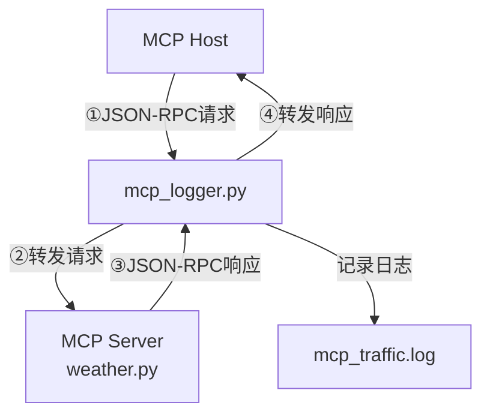
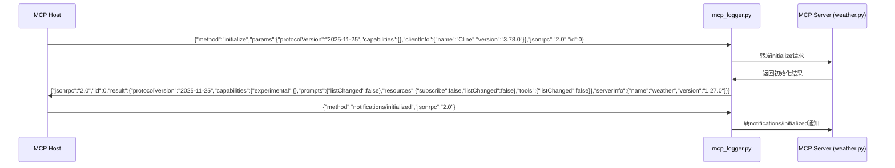
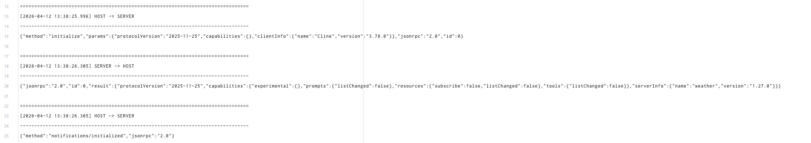
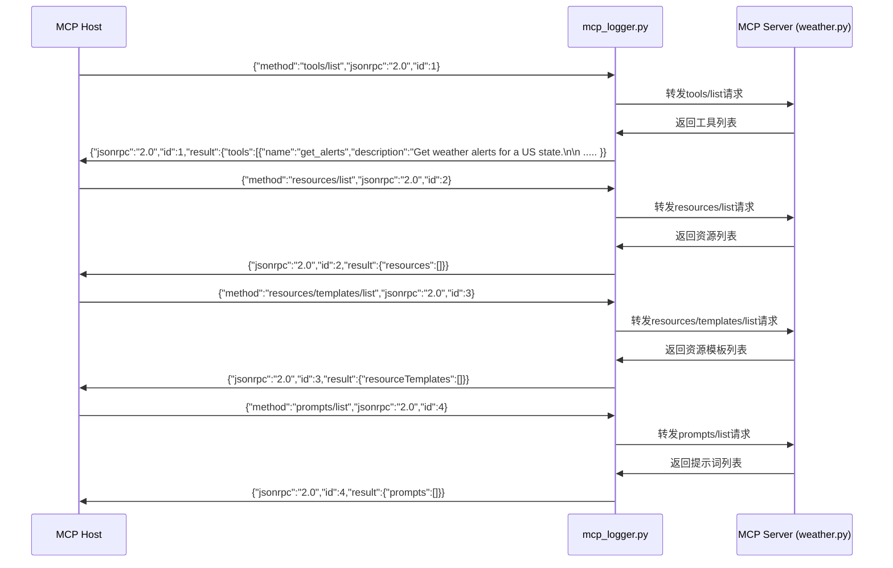
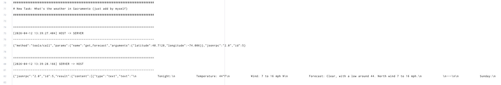
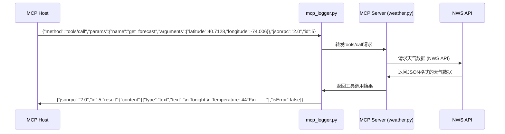

# MCP Host 与 MCP Server 交互流程图

## 整体架构图

## 详细交互流程图

### 1. 初始化阶段

> mcp_traffic.log 13-25行

### 2. 工具和能力发现阶段

> mcp_traffic.log 28-65行，因文本较长，部分省略

### 3. 工具调用阶段

> mcp_traffic.log 75-82行，因文本较长，部分省略

## 数据流说明

1. **初始化流程**：
   - Host发送`initialize`请求，包含协议版本、客户端信息和能力
   - Server返回支持协议版本、能力和服务器信息
   - Host发送`notifications/initialized`通知，表示初始化完成

2. **能力发现流程**：
   - Host依次请求工具列表、资源列表、资源模板列表和提示词列表
   - Server返回相应的能力信息

3. **工具调用流程**：
   - Host调用`get_forecast`工具，传入经纬度参数
   - Server接收请求，调用NWS API获取天气数据
   - Server处理数据并格式化响应
   - 通过`mcp_logger.py`返回结果给Host

## 日志记录

所有交互都通过`mcp_logger.py`进行中转，并记录到`mcp_traffic.log`文件中，包含：
- 时间戳
- 传输方向（HOST -> SERVER 或 SERVER -> HOST）
- 完整的JSON-RPC协议消息内容
- 错误信息（如有）